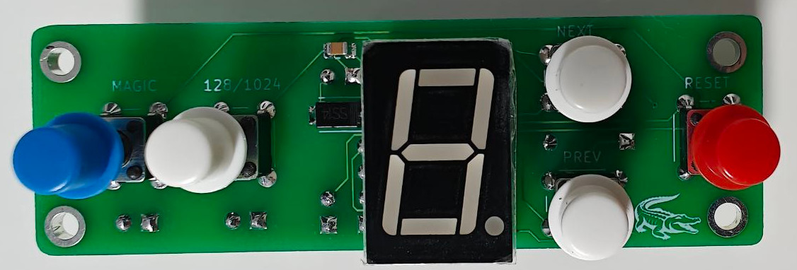
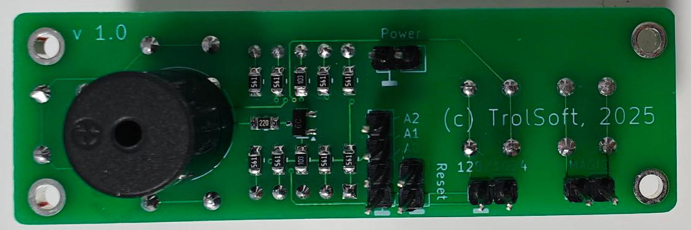
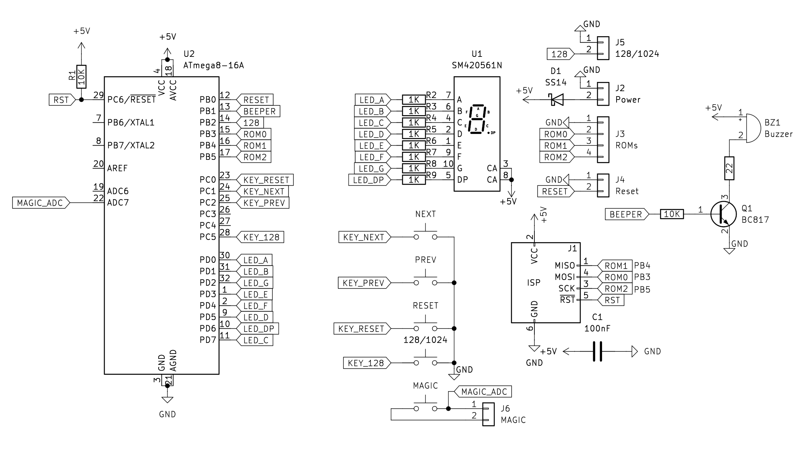

# Переключатель прошивок для Pentagon 1024zp

## Назначение
Устройство предназначено для монтажа на лицевую панель компьютера, позволяет выбирать прошивки переключением старших адресов ПЗУ. Также содержит кнопки для выбора режима памяти "128/1024" и "Magic". Номер выбранной прошивки отображается на 7-сегментном дисплее. Режим 128кб отображается точкой. Длительное удержание кнопок "Вверх", "Вниз", "128/1024" сохраняет выбор в энергонезависимой памяти МК.

## Внешний вид

## Схема

## BOM

[Интерактивный BOM](http://htmlpreview.github.io/?https://github.com/trol73/avr-croco-switch/blob/main/bom/ibom.html)

## Прошивка

Прошивка написана на языке The Rat: https://trolsoft.ru/soft/the-rat-avr

Фьюзы atmega8:

LOW: 0x44

HIGH: 0xdf
