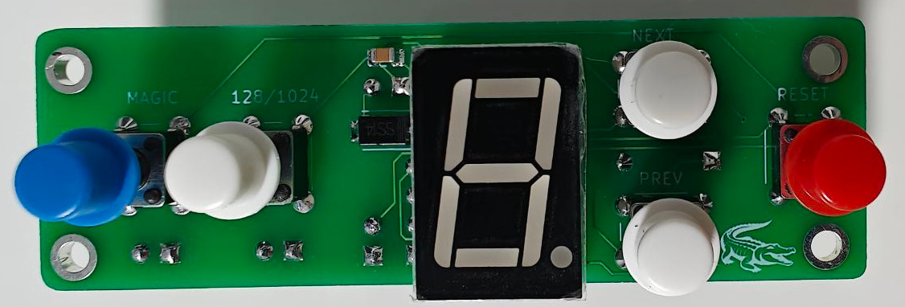
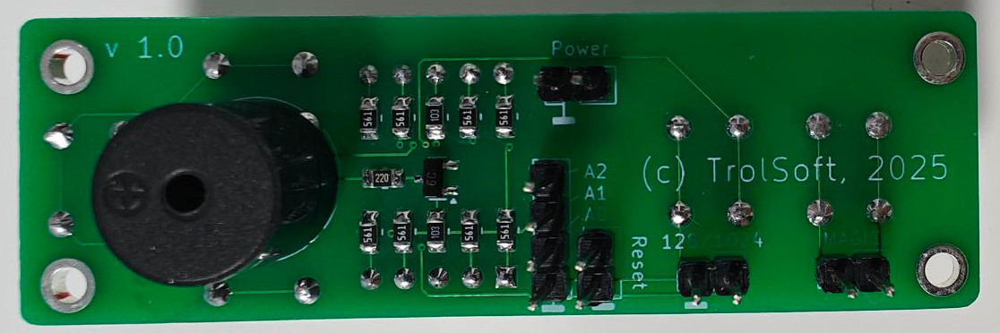
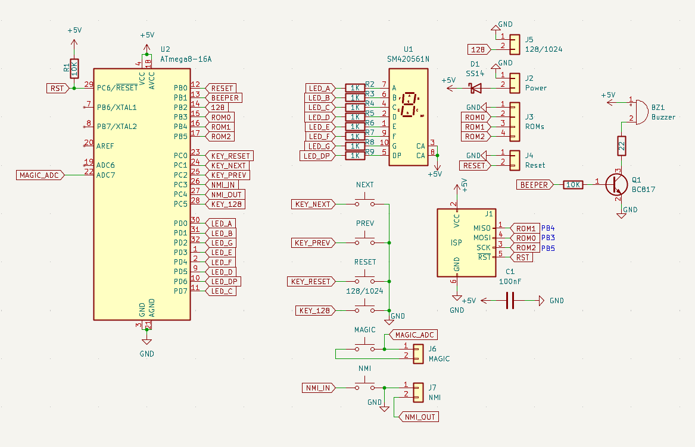
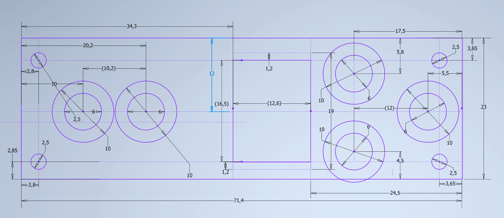

# Переключатель прошивок для Pentagon 1024zp

## Назначение
Устройство предназначено для монтажа на лицевую панель компьютера, позволяет выбирать прошивки переключением старших адресов ПЗУ. Также содержит кнопки для выбора режима памяти "128/1024" и "Magic". Номер выбранной прошивки отображается на 7-сегментном дисплее. Режим 128кб отображается точкой. Длительное удержание кнопок "Вверх", "Вниз", "128/1024" сохраняет выбор в энергонезависимой памяти МК.

## Внешний вид

## Схема

## BOM

[Интерактивный BOM (v1.0](http://htmlpreview.github.io/?https://github.com/trol73/avr-croco-switch/blob/main/bom-v1.0/ibom.html)

[Интерактивный BOM (v1.1](http://htmlpreview.github.io/?https://github.com/trol73/avr-croco-switch/blob/main/bom-v1.1/ibom.html)

## Прошивка

Прошивка написана на языке The Rat: https://trolsoft.ru/soft/the-rat-avr

Фьюзы atmega8:

LOW: 0x04

HIGH: 0xdf

## Модель лицевой панели
[Лицевая панель для корпуса PowerCool Slim V2](https://github.com/trol73/avr-croco-switch/blob/main/models/face-panel.stl)

## Габариты
